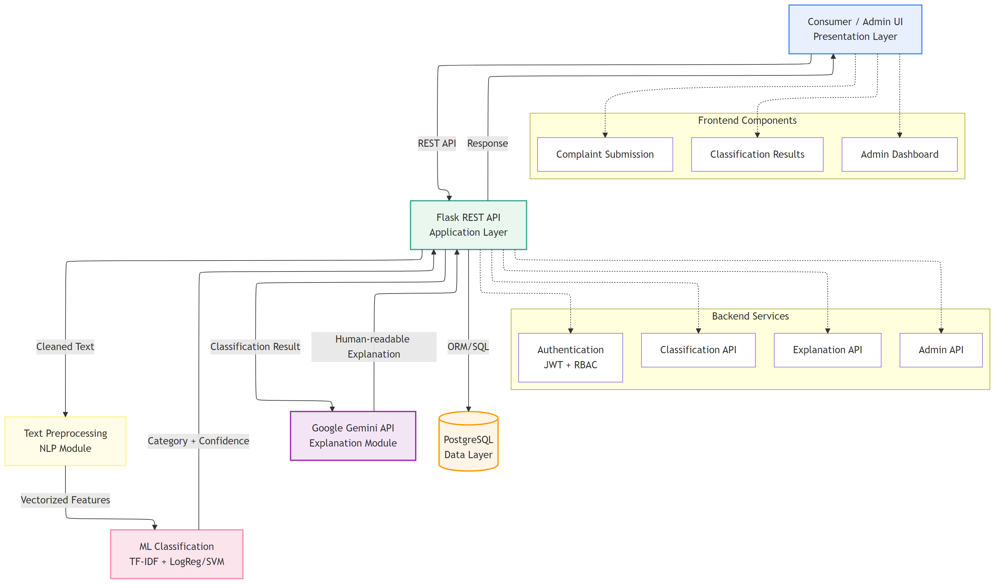

# AI-Based Consumer Complaints Classification System

An intelligent `N-Tier enterprise application` that automatically classifies consumer complaints using `Machine Learning (Scikit-learn)` and generates human-readable explanations using `Google Gemini`.

---

## 📑 Table of Contents

- [Abstract](#abstract)
- [Problem Statement](#problem-statement)
- [Key Features](#key-features)
- [System Architecture](#system-architecture)
- [Technology Stack](#technology-stack)
- [Contributing](#contributing)
- [Organization](#organization)
- [About & Community](#about--community)
- [Attribution & License](#attribution--license)

---

## 📌 Abstract

Consumer-facing organizations receive massive volumes of textual complaints through digital platforms. Manual classification of these complaints is inefficient, inconsistent, and hard to scale. This project presents an **AI-Based Consumer Complaints Classification System** that leverages **Machine Learning (ML)** and **Natural Language Processing (NLP)** to automatically categorize complaints into classes like Billing, Service, or Delivery.

Uniquely, a **Generative AI module (Google Gemini)** is integrated as a post-classification layer to generate human-readable explanations for the model's decisions, improving transparency and trust ("Explainable AI"). The system implements a robust **Enterprise N-Tier Architecture** ensuring scalability and maintainability.

> 📖 **For the complete abstract (single source of truth), see [docs/01_abstract.md](docs/01_abstract.md).**

---

## 🎯 Problem Statement

Processing consumer feedback effectively is critical for business retention, but organizations face several hurdles:

- **Volume**: High volume of complaints makes manual reading impossible.
- **Inconsistency**: Different support agents classify similar complaints differently.
- **Lack of Explanation**: Traditional "Black Box" ML models give a label (e.g., "Billing") without explaining *why*, reducing trust.
- **Architecture Gaps**: Many academic AI projects lack structure, making them unusable in real-world enterprise scenarios.

This project solves this by combining **deterministic ML classification** for speed with **Generative AI** for clarity, wrapped in a professional N-Tier structure.

---

## 🎯 Key Features

- ✨ **Hybrid AI Engine**
  - **Deterministic ML**: Scikit-learn (Logistic Regression/SVM) for high-speed, consistent classification.
  - **Generative AI**: Google Gemini for natural language explanations.
  - **NLP Pipeline**: Production-grade cleaning, tokenization, and TF-IDF vectorization.

- 🧱 **Enterprise-Grade N-Tier Architecture**
  - **Presentation**: RESTful API endpoints (JSON).
  - **Application**: Flask orchestrating logic and security.
  - **Domain/ML**: Dedicated modules for Inference and Explanation.
- **Data Access**: Parameterized SQL via `psycopg2` (ORM planned).
  - **Data**: Relational persistence (PostgreSQL/MySQL).

- 🧠 **Explainable AI (XAI)**
  - Generates context-aware summaries.
  - Ensures predictions are not just labels, but *insights*.
  - Prompt Engineering strategy optimized for factual grounding.

- 🔐 **Secure & Scalable**
  - Environment-based configuration.
- SQL-injection safe (parameterized queries).
  - Modular design allows replacing the ML model without breaking the API.

- 📊 **Data & Analytics Ready**
  - Stores all complaints, predictions, and confidence scores.
  - Enables future reporting on "Most Frequent Complaint Types".

---

## 🏗️ System Architecture

### Diagram

---

## 🧰 Technology Stack

| Layer | Technology |
| :--- | :--- |
| **API / Backend** | Python 3.12, Flask |
| **Machine Learning** | Scikit-learn, TF-IDF Vectorizer |
| **Generative AI** | Google Gemini API |
| **Database** | PostgreSQL / MySQL |
| **Container** | Docker / Podman (Optional) |
| **Architecture** | N-Tier (5 Layers) |

---

## 🤝 Contributing

Contributions are welcome! Please read [CONTRIBUTING.md](CONTRIBUTING.md).

---

## 🏢 Organization

This project is part of the **[Srivari-Hema-SSPL-2026](https://github.com/Srivari-Hema-SSPL-2026)** ecosystem.

---

## 📞 About & Community

### [Swamy's Tech Skills Academy](https://www.linkedin.com/company/swamy-s-tech-skills-academy) & [ShyvnTech](https://www.linkedin.com/company/shyvntech)

This repository is maintained by **Viswanatha Swamy P K**. It serves as a reference architecture for integrating Predictive ML and Generative AI in enterprise systems.

---

## 📝 Attribution & License

Licensed under the [MIT License](LICENSE).
© 2026 Swamy's Tech Skills Academy, ShyvnTech & Srivari Software Solutions.

**⭐ If you find this architecture useful, please star the repository!**
