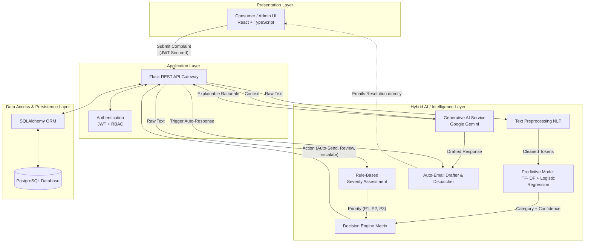

# AI-Driven Consumer Complaint Intelligence System

[](LICENSE)
[](https://github.com/Bhanu-Koppadi/consumer-complaints-ml-genai-ntier)
[](#system-architecture)
[](https://www.python.org/)
[](https://react.dev/)
[](https://www.typescriptlang.org/)
[](https://scikit-learn.org/)
[](https://flask.palletsprojects.com/)
[](https://www.postgresql.org/)
[](https://ai.google.dev/)
[](https://github.com/Bhanu-Koppadi)

An intelligent `N-Tier enterprise application` that automatically classifies consumer complaints using `Machine Learning (Scikit-learn)` and generates human-readable explanations using `Google Gemini`.

---

## 📑 Table of Contents

- [Abstract](#abstract)
- [Problem Statement](#problem-statement)
- [Key Features](#key-features)
- [System Architecture](#system-architecture)
- [Technology Stack](#technology-stack)
- [Local Setup & Quickstart](#local-setup--quickstart)
- [License](#license)
- [Acknowledgements](#acknowledgements)

---

## 📌 Abstract

Consumer-facing organisations across banking, e-commerce, healthcare, and telecommunications receive thousands of complaints daily through digital channels. Existing complaint management systems fail on three critical dimensions: they cannot prioritise emergencies dynamically, they offer no transparency into automated routing decisions, and they lack the architectural integrity required for enterprise-scale deployment. This creates operational backlogs where financial fraud reports are queued alongside minor billing inquiries, eroding both efficiency and consumer trust.

This project presents an **AI-Driven Consumer Complaint Intelligence System** that addresses these gaps through a hybrid three-paradigm intelligence strategy. First, a Predictive Machine Learning pipeline using TF-IDF vectorisation and Logistic Regression classifies unstructured complaint text into product categories with measurable accuracy. Second, a Rule-Based Severity Assessment Engine deterministically assigns priority levels P1 Emergency, P2 Operational, and P3 General, using keyword heuristics at zero latency, guaranteeing no emergency complaint is ever missed. Third, a Generative AI layer powered by Google Gemini produces human-readable explanations for every classification decision and autonomously drafts professional email responses. 

These three intelligence vectors are orchestrated through a Decision Engine Matrix that routes each complaint to one of three outcomes: Auto-Send, Review Required, or Escalate, based on ML confidence scores and severity level. The entire pipeline is deployed within a Five-Layer Enterprise N-Tier Architecture comprising React 19 (Presentation), Flask REST API with JWT and RBAC (Application), the Hybrid AI modules (Intelligence), SQLAlchemy ORM (Data Access), and PostgreSQL 16 (Database).

> 📖 **For the complete abstract (single source of truth), see [docs/01_abstract.md](docs/01_abstract.md).**

---

## 🎯 Problem Statement

Processing consumer feedback effectively is critical for business retention, but organizations face several hurdles:

- **Volume**: High volume of complaints makes manual reading impossible.
- **Inconsistency**: Different support agents classify similar complaints differently.
- **Lack of Explanation**: Traditional "Black Box" ML models give a label (e.g., "Billing") without explaining *why*, reducing trust.
- **Architecture Gaps**: Many academic AI projects lack structure, making them unusable in real-world enterprise scenarios.

This project solves this by combining **deterministic ML classification** for speed with **Generative AI** for clarity and **Priority Routing** for automated severity workflows, all scaled within a professional Enterprise N-Tier structure.

---

## 🎯 Key Features

- ✨ **Hybrid AI Engine**
  - **Deterministic ML**: Scikit-learn (Logistic Regression/SVM) for high-speed, consistent classification.
  - **Decision Engine Routing**: Uses ML confidence scores to determine Auto-Send, Review Required, or Escalate pathways.
  - **Severity Assessment**: Deterministic rule-based engine assigns zero-latency priority levels (P1 Emergency, P2 Operational, P3 General).
  - **Generative AI Responses**: Google Gemini autonomously drafts professional email responses.
  - **NLP Pipeline**: Production-grade cleaning, tokenization, and TF-IDF vectorization.

- 🧱 **Enterprise-Grade N-Tier Architecture**
  - **Presentation**: Modern React SPA with Tailwind CSS, built with TypeScript and Vite.
  - **Application**: Flask orchestrating logic and security.
  - **Domain/ML**: Dedicated modules for Inference and Explanation.
- **Data Access**: Parameterized SQL via `psycopg2` (ORM planned).
  - **Data**: Relational persistence (PostgreSQL/MySQL).

- 🧠 **Explainable AI (XAI)**
  - Generates context-aware summaries.
  - Ensures predictions are not just labels, but *insights*.
  - Prompt Engineering strategy optimized for factual grounding.

- 🔐 **Secure, Role-Based & Scalable**
  - Strong **JWT Authentication** and **Role-Based Access Control (RBAC)** separating Consumers and Administrators.
  - Environment-based configuration.
  - SQL-injection safe (parameterized queries).
  - Modular design allows replacing the ML model without breaking the API.

- 📊 **Data & Analytics Ready**
  - Stores all complaints, predictions, and confidence scores.
  - Enables future reporting on "Most Frequent Complaint Types".

---

## 🏗️ System Architecture

### Hybrid System Architecture (with Decision Engine & GenAI)


```mermaid
graph TD
    %% Presentation Layer
    subgraph Presentation Layer
        UI[Consumer / Admin UI <br/> React + TypeScript]
    end

    %% Application Layer
    subgraph Application Layer
        API[Flask REST API Gateway]
        Auth[Authentication <br/> JWT + RBAC]
    end

    %% Hybrid Intelligence Layer
    subgraph Hybrid AI / Intelligence Layer
        direction LR
        NLP[Text Preprocessing NLP]
        ML[Predictive Model <br/> TF-IDF + Logistic Regression]
        Sev[Rule-Based <br/> Severity Assessment]
        Dec[Decision Engine Matrix]
        GenAI[Generative AI Service <br/> Google Gemini]
        AutoSend[Auto-Email Drafter & Dispatcher]
    end

    %% Data Layer
    subgraph Data Access & Persistence Layer
        ORM[SQLAlchemy ORM]
        DB[(PostgreSQL Database)]
    end

    %% Connections
    UI -- "Submit Complaint \n (JWT Secured)" --> API
    API <--> Auth
    
    API -- "Raw Text" --> NLP
    NLP -- "Cleaned Tokens" --> ML
    ML -- "Category + Confidence" --> Dec
    API -- "Raw Text" --> Sev
    Sev -- "Priority (P1, P2, P3)" --> Dec
    Dec -- "Action (Auto-Send, Review, Escalate)" --> API
    
    API -- "Context" --> GenAI
    GenAI -- "Explainable Rationale" --> API
    GenAI -- "Drafted Response" --> AutoSend
    API -- "Trigger Auto-Response" --> AutoSend
    AutoSend -. "Emails Resolution directly" .-> UI
    
    API <--> ORM
    ORM <--> DB
```

---

## 🧰 Technology Stack

| Layer | Technology |
| :--- | :--- |
| **Frontend UI** | React 18, TypeScript, Tailwind CSS, Vite |
| **API / Backend** | Python 3.12, Flask, JWT Authentication |
| **Machine Learning** | Scikit-learn, TF-IDF Vectorizer |
| **Generative AI** | Google Gemini API (Explanation generation) |
| **Database** | PostgreSQL |
| **Containerization** | Docker Compose |

---

## 🚀 Local Setup & Quickstart

### Prerequisites
- Docker Desktop (for Database)
- Node.js 20+ (for Frontend)
- Python 3.12+ (for Backend)

### 1. Database Setup
```bash
cd infra
docker-compose up -d
```

### 2. Backend Setup
```bash
cd src/backend
# Copy environment variables and insert your Gemini API key:
cp .env.example .env

# Create virtual environment and install dependencies:
python -m venv .venv
# Activate venv: ".venv\Scripts\activate" (Windows) or "source .venv/bin/activate" (Mac/Linux)
pip install -r requirements.txt

# Run the Flask API Server:
python app.py
```

### 3. Frontend Setup
```bash
cd src/frontend

# Install node modules:
npm install

# Start the Vite development server:
npm run dev
```

Visit `http://localhost:5173` to access the application!

## 📜 License

This project is licensed under the [MIT License](LICENSE). See the [LICENSE](LICENSE) file for details.

This project is intended for **academic and educational use**.

---

## 🙌 Acknowledgements

- **Python** - Core language and ecosystem
- **Scikit-learn** - Traditional ML modeling and evaluation
- **Flask** - Lightweight web framework for the API layer
- **PostgreSQL** - Relational database for persistence (deployment-dependent)
- **Google Gemini API** - Generative explanations for predictions
- **Open Source Contributors** - For the tools and libraries that made this possible

**⭐ If you find this architecture useful, please star the repository!**
