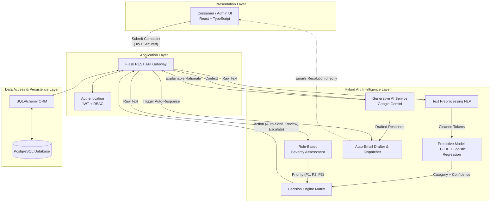
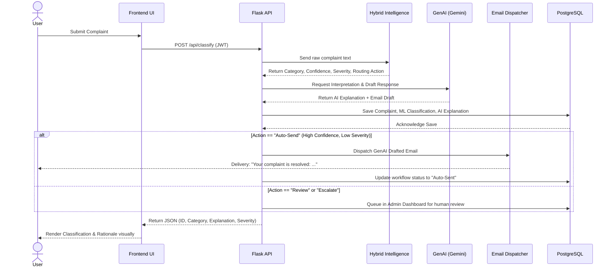
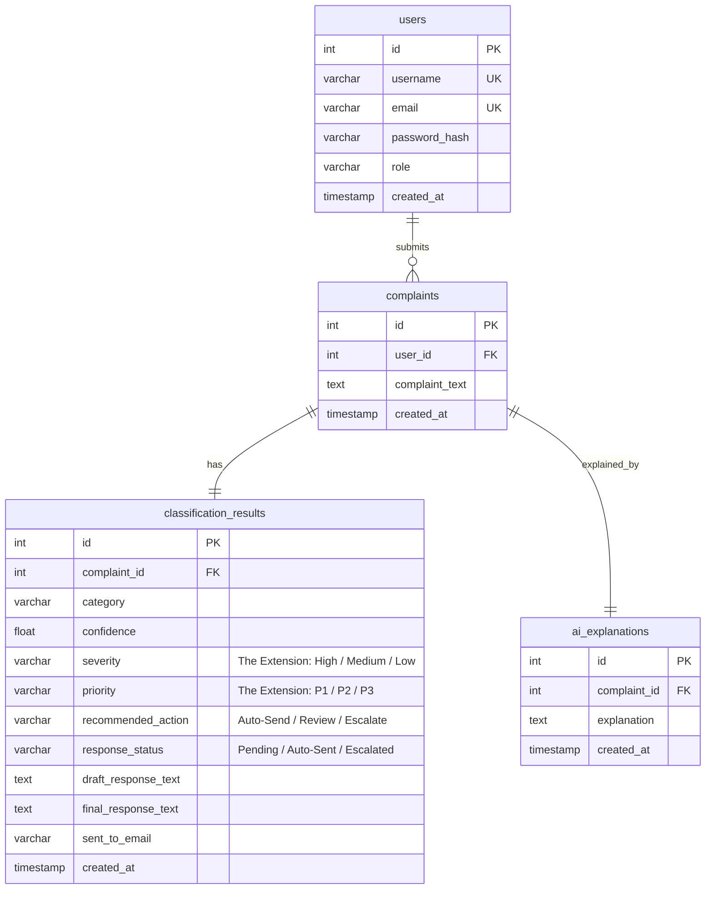

# Updated Architecture Diagrams (With Extensions)

Because IEEE papers and technical documentation require high-quality visuals, I have generated **Mermaid based diagrams** for you. Mermaid is an industry-standard charting language that renders automatically in GitHub, GitLab, Notion, and many Markdown editors.

You can paste these directly into any Mermaid-supported Markdown viewer or use the [Mermaid Live Editor](https://mermaid.live/) to convert them into high-resolution PNG/SVG images for your IEEE paper!

---

## 1. Hybrid System Architecture Diagram

This diagram completely replaces the old layer diagrams. It clearly maps your unique extensions: the **Severity & Decision Engine** and the **Auto-Email Dispatcher**.

---

## 2. Updated Sequence Diagram

This sequence replaces the mentor's sequence. Note the new split path (`alt`) at the bottom where the system intelligently decides whether to Auto-Send an email or queue it for review based on your **Decision Engine**.

---

## 3. Updated Entity Relationship Diagram (ERD)

This completely updates the mentor's database schema diagram. Look at the `classification_results` table—it now accurately reflects all the powerful workflow columns you added!

